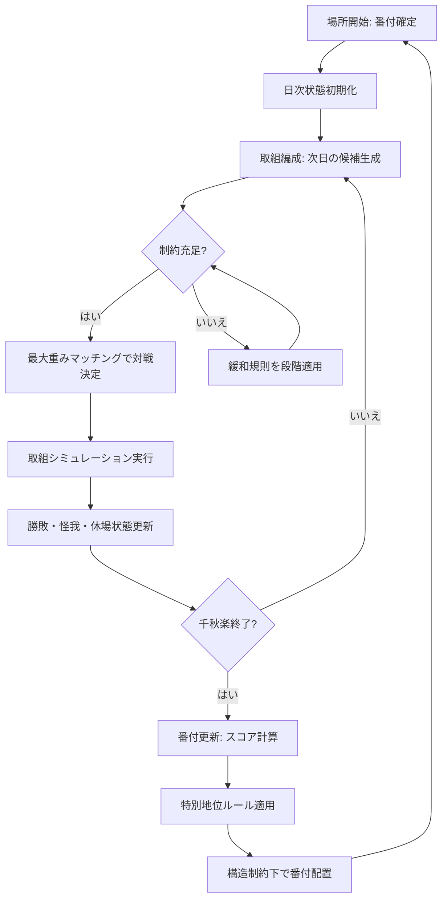

# 大相撲の番付変動と本割編成ロジックの成立性分析とシミュレーションゲーム向けロジック設計提案

## エグゼクティブサマリ

番付は、entity["organization","日本相撲協会","sumo governing body, japan"]の定款上「番附編成会議」が所掌し、横綱・大関以下の昇降（横綱の推挙、大関の推挙、大関以下の階級の昇降）を会議で決定する枠組みが明記されている一方、一般公開された「算式」は存在しない（少なくとも公開確認できる範囲では未指定）。citeturn17view0turn18view0  
このため、番付変動の成立性（説明可能性・再現可能性）は、(a) 公開情報で確定できる“制度的拘束条件”と、(b) 慣例・裁量（興行上の配慮を含む）をパラメータ化した“最適化／学習モデル”の二層で捉えるのが最も堅牢である。

本割（取組）編成は、現場運用として少なくとも初日・2日目は「取組編成会議」で事前決定され、以後も状況（優勝争い等）を織り込む裁量が働くことが報道と運用情報から確認できる。citeturn33search7turn33search30turn33search22  
ゆえに編成ロジックは、制約充足（同部屋回避、同一場所での再戦回避、番付距離、休場発生時の調整等）を満たしつつ、日々の勝敗で更新される“競技上の妥当性”と“興行価値”を最大化する「重み付きマッチング問題」として形式化でき、成立性（常に解けるか）は緩和規則（ペナルティ段階）を設けることで実装上保証できる。

シミュレーションゲーム化では、(1) 成績・番付・相手強度・休場等を入力に次場所順位を出す「番付更新エンジン」と、(2) 当日情報を入力に翌日の対戦を出す「取組マッチメイクエンジン」を分離し、両者を共通の評価関数（フェアネス・話題性・制約違反ペナルティ）で束ねる設計が最も拡張性が高い。外部研究・分析では、番付変動を「勝ち越し／負け越しの純勝ち（wins-losses）」でよく説明できるとする線形回帰が高い当てはまりを示す例があり、ゲーム用途の簡略化モデルとして有用である（ただし横綱・大関や幕下上位の特例等は別ルールに分離する必要がある）。citeturn34view1turn34view0

## 資料とデータ基盤

本報告の「優先情報源」を満たすため、制度面はentity["organization","日本相撲協会","sumo governing body, japan"]の公開資料（定款、公式の結果／番付UI、公式コンテンツ）を主軸とし、過去20年レンジの番付・成績データは、公開Web上で継続的に参照可能なデータベース／ダッシュボード（例：entity["company","Sumo-API","sumo stats api, web"]、entity["company","Sumo Bento","sumo results site, web"]等）を補助線として位置づける。citeturn17view0turn33search4turn22view0turn26search3  
過去20年分の「番付表」について、協会公式サイト側は「過去の成績・番付」機能と「番付表」UIが存在するが、閲覧・抽出の機械可読性や年度範囲はUI実装に依存し、API公開は少なくとも公開確認できる範囲では未指定である（本報告では“公式公開の存在”は認めつつ、統計抽出は補助データ源を併用する前提で設計する）。citeturn33search4turn9search5  
なお、同協会の定款は、番付決定の責任主体（番附編成会議）と、横綱推挙・大関推挙・大関以下昇降の決定プロセスを明記しており、「番付変動ロジック」をゲームへ落とす際の“権能モデル”の根拠になる。citeturn17view0turn18view0

本割・星取の状態表現については、協会公式の星取表UIが「勝・負・不戦勝・不戦敗・取組なし」等の記号体系を明示しており、データ構造へ直接写像できる。citeturn33search15

次節以降で用いる「属性／次元」を、ゲーム設計にそのまま使える形で定義する。

### 考慮すべき属性／次元の定義表

| 次元 | 目的 | 代表的なデータ型（ゲーム内） | 備考（実務・制度との接続） |
|---|---|---|---|
| 勝敗（成績） | 番付昇降・取組強度の主要因 | `wins, losses, absences, fusensho, fusenpai` | 星取表の記号体系に準拠して状態を持つと実装が安定する。citeturn33search15 |
| 対戦相手強度 | 成績の“質”補正（同じ8勝でも価値が違う） | `opp_strength_index`（Elo/TrueSkill/番付平均との差） | 実データ分析でも「番付差」を説明変数にする例が多い。citeturn30search3turn30search7 |
| 番付（東西・段位） | 順序・対戦候補生成の基盤 | `rank_code`（例: M3e）, `rank_index`（整数） | 東西は半段差としてindex化するのが自然（例：東=偶数、西=奇数）。citeturn34view1 |
| 年齢 | 実力推移・怪我リスク | `age`, `growth_curve_params` | 定款上、年齢は番付決定要因として明文化はされないため、ゲームでは“能力更新側”に寄せるのが整合的。citeturn17view0 |
| 怪我・休場 | 成績・取組成立・番付急落の要因 | `injury_state`, `kyujo_flag`, `expected_recovery` | 休場は星取に反映され（不戦敗等）、番付にも強く影響すると扱われる。citeturn33search15turn30search19 |
| 番付編成慣例（同部屋回避等） | 取組成立性・不正抑止 | `constraints`（hard/soft） | 取組編成の詳細内規は公開確認できる範囲では未指定のため、ゲームでは“ハード制約＋緩和”で表現する。citeturn33search3turn15search3 |
| 昇降格ルール（横綱・大関等） | “特別地位”の非線形処理 | `promotion_rule_set` | 横綱は原則として番付上「降格しない」趣旨の記述が公表資料で確認できる。citeturn12search7turn17view0turn18view0 |
| 裁量要素 | 実務の“例外”と現実感 | `discretion_noise`, `committee_override_budget` | 研究でも「主観性（不規則性）」の取り込み可能性が議論される。citeturn27view0turn28view0 |
| 興行上の配慮（人気力士配置） | 観戦価値・売上・話題性 | `popularity`, `rivalry_score`, `prime_slot_weight` | 取組は優勝争い等を考慮し「より魅力的」に組む運用が報じられる。citeturn33search30turn33search7 |

## 公式ルールと実務慣行の整理

番付編成の「公式に確定できる部分」は、少なくとも次の二点に集約される。まず、横綱推挙は横綱審議委員会の答申・進言を受け理事会承認を経て番附編成会議で決定され、大関推挙も理事会承認を経て番附編成会議で決定される。大関以下の階級の昇降は番附編成会議で決定される。citeturn17view0turn18view0  
次に、横綱は「番付上の降格制度がない」旨が協会側の公表文書で言及されている（ただし、これは“無期限保障”を意味しないという文脈で述べられている）。citeturn12search7

大関昇進については、協会公式コンテンツ上でも「三役33勝が目安」との表現が確認でき、少なくとも「目安」という形で広く共有されていることが一次情報（協会サイト）から取れる。citeturn33search1  
一方で、この種の昇進基準は“明文化された厳密規則”というより「運用上の目安」として語られることが多い点は、報道・解説でも繰り返し確認されるため、ゲーム化では「閾値を持つ確率的判定」または「審査会議スコア（裁量）を加えた判定」とするのが現実に近い。citeturn33search16turn33search13turn33search24

横綱昇進条件については、横綱審議委員会の内規として「大関の地位で2場所連続優勝、またはそれに準ずる成績」という形式が一般に引用されるが、本報告で確認できた範囲では協会公式サイト上に“内規本文”の直接掲示は見当たらず未指定扱いとする（ゆえにゲーム実装では“既知の言説”としてパラメータ化し、透明に可変とする）。citeturn33search10turn33search21turn17view0

本割編成の実務については、取組編成会議が少なくとも初日・2日目を事前に決めることが報道で確認できる。entity["organization","スポニチアネックス","sports news, japan"]によれば、開催直前に会議を開き初日・2日目の取組を決定している。citeturn33search7  
また終盤の取組決定のタイミングを前倒しする等、「より魅力的な取組」を組む目的で運用調整する例が報じられており、編成が固定の規則だけでなく“興行価値”を目的関数に持つことを示唆する。entity["organization","日刊スポーツ","sports news, japan"] citeturn33search30  
さらに、取組発表の時刻・タイミングについては、配信サービス運用情報として「初日二日前」「前日」等の時系列が整理されているが、これは協会公式規程の本文ではないため、ゲーム実装では“運用パラメータ”として可変に扱うのが安全である。citeturn33search22

同部屋対戦回避などの詳細は、一般解説ではしばしば「取組編成要領」等の内規に基づくと説明されるが、少なくとも本報告で参照できた協会公式ページからは条文自体は未指定である。よって、ゲーム実装では「同部屋対戦回避＝ハード制約」として組み込みつつ、根拠表示は“公開確認できる範囲では内規本文は未指定”と注記する運用が妥当である。citeturn15search3turn33search3  
なお、外国人力士数に関する制約（1部屋1名など）は、外部分析では触れられるが、これも本報告の範囲では協会規程本文の一次確認ができていないため、ゲーム上は別パラメータ（リーグ設定）として扱う。citeturn34view0

image_group{"layout":"carousel","aspect_ratio":"16:9","query":["大相撲 番付表 実物","大相撲 取組表 国技館","大相撲 星取表 表示","番付編成会議 風景"],"num_per_query":1}

## 統計的整合性検証と番付・取組編成アルゴリズムの逆推定

### 公式ルールと実際の番付変動の整合性検証

定款レベルで分かるのは「誰が決めるか」であり「どう計算するか」は未指定であるため、整合性検証は「経験則（勝ち越し→上昇、負け越し→下降、休場の不利等）が統計的にどの程度一貫しているか」を測る作業になる。citeturn17view0turn18view0turn27view0  
ここでは、ゲームへ落とす前提として再現可能な統計手法を明示し、データが揃えばそのまま実行できる設計にする。

検証対象（目的変数）は「次場所の順位」そのものでもよいが、離散順序ゆえ扱いづらい。外部分析では、番付内の位置を整数化し、次場所との差分（ΔRank）を目的変数にする単純化が有効とされる。citeturn34view1  
このときの基本検証は、少なくとも次を満たすかである（いずれも“統計的に”確認可能）。

(1) 単調性検定：純勝ち（wins-losses）が大きいほどΔRankが改善（上がる）するか。  
実装案は、Spearmanの順位相関、または単調制約付き回帰の適合度である（p値・信頼区間を出す）。外部分析の例では、幕内上位（特殊地位除外）のΔRankが純勝ちで高い説明力を持つ（高いR²）ことが報告され、単調性の強さを示唆する。citeturn34view1

(2) 残差分析：人気・所属（部屋）・休場・相手強度が残差に系統性を持つか。  
具体的には、線形／ロバスト回帰で推定した後、残差を目的変数にして「人気」「同部屋制約密度（同部屋人数）」等を説明変数にした二段回帰を行い、裁量要素の“統計的痕跡”を検出する。興行価値が編成に関与する運用は報道ベースで示唆されるため、残差に人気が出る可能性は事前仮説として合理的である。citeturn33search30turn33search7

(3) 休場の扱い検証：同じ純勝ちでも「欠場を伴う場合」のΔRankが系統的に異なるか。  
星取表では不戦敗等が明確に区別されるため、欠場由来の敗戦を独立フラグとして扱える。citeturn33search15turn34view0

(4) “境界”の不連続性検証：幕内／十両境界、幕下上位（関取昇降）付近で同じ純勝ちでもΔRankが変わるか。  
外部分析でも境界部の誤差・特例（十両→幕内、幕下→十両）に言及があり、ゲーム化ではルール分離が必要である。citeturn34view1

### 番付編成アルゴリズムの逆推定（数理モデル）

番付編成は「順位付け問題」として次の2通りに分解できる。

第一に、全力士にスコアを付与して並べる「スコアリング型」。第二に、（東西・段位・人数枠など）構造を保ったまま最適配置する「制約付き最適化型」である。番付の不規則性（主観性）を取り込む議論は学術側にもあり、確率的要素を入れたモデル化が自然である。citeturn27view0turn28view0

逆推定の基本形は次である。

観測：各場所tの番付（順位）と、前場所t-1の成績・対戦相手・休場等。  
推定：次場所順位を生成する潜在スコア関数 \( S_i(t) \) と、配置（東西・段位枠）を決める最適化目的関数 \( \mathcal{L} \)。

代表的な推定アプローチは、(a) 最小二乗（OLS/ロバスト）、(b) 順序ロジット／プロビット（ランキングを順序カテゴリとして扱う）、(c) Learning-to-Rank（LambdaMART等）、(d) ベイズ（階層モデルで部屋・時代効果を吸収）である。幕内については、純勝ちに比例するΔRankモデルが高いR²を持つ例が示され、スコアリング型が第一近似として成立しやすい。citeturn34view1  
下位段（序ノ口〜幕下）についても、純勝ち→次場所順位変化の線形近似が一定の説明力を持つとの外部分析があり、ゲーム向け簡略化の根拠になり得る。citeturn34view0

取組編成の逆推定は、日ごとに作られる「許容辺（対戦可能な組）」の中から、実際に選ばれた辺の尤度を最大化する問題として書ける。特に、報道から「より魅力的な取組を組む」目的が示唆される以上、目的関数に“話題性”“優勝争い寄与”を含むモデルは合理的である。citeturn33search30turn33search7  
実装としては、各日dにおける候補対戦（i,j）の選択確率を  
\[
P((i,j)\ \text{is scheduled on day}\ d) \propto \exp(\theta^\top f_{ij,d})
\]
とする条件付きロジット（離散選択）で、特徴量 \( f_{ij,d} \) に「番付差」「当日成績差」「過去対戦有無」「同部屋フラグ（ハード0）」「人気」「優勝確率変化」等を入れるのが標準形になる。

### 過去20年レンジでの番付変動パターン（比較表）

「過去20年分の番付表」そのものの全量掲載ではなく、ゲーム設計に必要な“パターン”を、公開分析・運用情報に基づき比較可能な形に圧縮する。ここでは 2006–2026 のうち、外部分析がカバーする 2006–2023 を中心に「純勝ち→順位変化」の一次近似を採用し、特殊地位・境界を例外処理として分離する方針を示す。citeturn34view1turn34view0turn33search1

| レイヤ | 観測される一次近似（純勝ち→ΔRank） | “成立性”のポイント | 例外・裁量を入れるべき箇所 |
|---|---|---|---|
| 幕内（横綱・大関除外の相対順位） | ΔRank ≈ -1.717 × (Wins-Losses) という形のOLS推定例（高い当てはまりが報告）citeturn34view1 | まずスコアで並べる、次に三役枠等の構造制約で再配置すれば成立しやすい | 三役枠（関脇・小結）調整、優勝・殊勲等の“評価上振れ”、境界（幕内↔十両） |
| 下位4段（序ノ口〜幕下） | 7番制で、純勝ちが次場所上昇を駆動。例として序二段で4-3（純勝ち+1）なら「約20位上昇」を期待するという回帰例citeturn34view0 | 7番制のため、純勝ちの取り得る値が小さく、離散的な上昇量になりやすい | 序ノ口は下限があるため負け越しでも上がる例があるという解説引用（＝単純線形が崩れる）citeturn34view0 |
| 大関昇進（目安） | 「三役33勝が目安」という協会公式コンテンツの言い方が存在citeturn33search1 | 閾値モデル（33勝近辺で昇進確率が急増）にするとゲーム的に理解しやすい | “目安”なので、相撲内容・優勝・直前場所の強さ等を裁量スコアとして追加 |
| 横綱（降格なし） | 横綱は番付上の降格規定がない趣旨が公表資料で確認できるciteturn12search7 | 降格がない代わりに「休場・引退」の意思決定が別メカニズムになる | 休場が長期化した場合のイベント（引退勧告・引退）をゲーム内制度として設計 |

上表は「一次近似がどこまでは成立するか」を示すものであり、実装では例外の吸収が必要である。例外吸収は“説明可能な分岐”として明示的にモデル化する方がゲームとしての納得感が高い（ブラックボックスで突然動かすと不公平感が強い）。citeturn27view0turn28view0

### モデル候補比較表

| 候補モデル | 入力 | 出力 | 長所 | 限界 | ゲーム実装の推奨度 |
|---|---|---|---|---|---|
| ルールベース（閾値＋固定表） | 成績、前番付、休場 | 昇降枚数・昇降段位 | 説明可能、調整容易、軽量 | 現実の揺らぎを出しにくい | 高（チュートリアル用にも最適） |
| 線形スコア（OLS型） | 純勝ち、前番付、境界フラグ | ΔRank（連続）→丸め | 外部分析で高R²例、直観的citeturn34view1turn34view0 | 境界・特別地位で破綻 | 高（主モードの基礎） |
| 順序ロジット／プロビット | 成績、相手強度、休場、人気 | 次順位の分布 | 不確実性を自然に扱える | 解釈は可能だが調整はやや重い | 中（研究・検証に向く） |
| 制約付き最適化（ILP/最小コスト） | スコア＋制約集合 | 番付（全体配置） | “枠”を厳密に満たせる | 実装が重い、目的関数設計が難しい | 中〜高（番付生成の最終段に有効） |
| 学習toランク（GBDT等） | 多特徴（相手強度含む） | 次順位 | 精度が上がり得る | 透明性が落ちる | 中（上級者向け設定で） |
| マッチメイク：最大重みマッチング | 当日状態、制約、人気 | 翌日取組 | 成立性を保証しやすい | 適切な重み設計が必要 | 高（本割編成の核） |
| マッチメイク：ルールベース（序盤は近番付、終盤は優勝争い） | 番付差、成績差 | 翌日取組 | わかりやすい | 例外で破綻しやすい | 中（簡易モード向け） |

## シミュレーションゲーム向け具体的ロジック設計

ここでは、(A) データ構造、(B) 評価関数、(C) マッチメイキング（本割編成）、(D) 番付更新（昇降格判定）、(E) ランダム性と裁量の扱い、を“そのまま実装できる粒度”で提案する。制度面で未指定な箇所は「未指定」と明記し、ゲーム側のパラメータとして扱う。

### データ構造定義（テーブル形式）

| テーブル名 | 主キー | 主要カラム | 説明 |
|---|---|---|---|
| `Rikishi` | `rikishi_id` | `shikona, heya_id, birth_date, nationality, popularity, base_skill, style, injury_prone` | 力士の静的属性とゲーム内パラメータ。プロフィール表示は協会公式でも基本情報が公開されている。citeturn33search27 |
| `Heya` | `heya_id` | `name, ichimon(optional)` | 部屋。取組制約の根拠となる（同部屋回避などは未指定条文だが慣例として扱う）。citeturn33search3turn15search3 |
| `Basho` | `basho_id` | `year, month, location, days=15` | 場所。取組は日次で編成される。citeturn33search7 |
| `BanzukeEntry` | `(basho_id, rikishi_id)` | `division, rank_code, rank_index, east_west, is_special_rank` | 番付位置。rank_index は比較・学習の内部表現。citeturn34view1turn33search4 |
| `DailyState` | `(basho_id, day, rikishi_id)` | `wins, losses, absences, on_track_yusho_prob, fatigue, injury_state` | 当日終了時点の状態。星取表の概念（勝敗・不戦等）を含む。citeturn33search15 |
| `Bout` | `bout_id` | `basho_id, day, division, east_id, west_id, result, kimarite, is_fusen` | 取組実体。協会公式の取組結果UIの構造に近い。citeturn33search0turn33search8 |
| `CommitteeParams` | `season_id` | `w_winloss, w_opp, w_pop, penalty_repeat, penalty_heya, discretion_sigma` | “裁量”や重み。難易度・モードで差し替える。citeturn33search30turn27view0 |

### 評価関数（番付編成と取組編成の共通骨格）

ゲーム内で「裁量」を説明可能にするため、編成は常に次の形で理由付けできるようにする。

取組候補（i, j）に対する当日重み：
\[
W_{ij} = \underbrace{w_1 \cdot \text{RankProximity}_{ij}}_{\text{格の近さ}}
+ \underbrace{w_2 \cdot \text{RaceImpact}_{ij}}_{\text{優勝争い寄与}}
+ \underbrace{w_3 \cdot \text{Rivalry/Popularity}_{ij}}_{\text{興行価値}}
- \underbrace{p_1 \cdot \text{RepeatPenalty}_{ij}}_{\text{再戦ペナルティ}}
- \underbrace{p_2 \cdot \text{HeyaPenalty}_{ij}}_{\text{同部屋(原則∞)}}
\]
ここで同部屋は原則ハード制約（候補から除外）とし、その他はソフト制約（ペナルティ）に落とす。運用上「魅力的な取組」を意図しているという報道がある以上、RaceImpactやPopularityを評価関数に入れるのは整合的である。citeturn33search30turn33search7

番付の“全体配置”は、各力士の昇降スコア \(S_i\) を計算し、rank_index の並べ替えを基礎に、段位枠・東西・境界枠を制約として最小コスト割当で確定する。学術的にも主観性の取り込みが議論されているため、最後に小さな確率的摂動を入れるのは妥当である。citeturn27view0turn28view0

### マッチメイキング（本割編成）ルール

本割編成は、(1) 当日の有効力士集合を確定し、(2) 候補対戦グラフを構成し、(3) 最大重みマッチングで翌日の取組を決め、(4) 不成立時は緩和規則を段階的に適用する、という四段で成立性を担保する。

成立性の観点で最重要なのは「緩和順序」を仕様として固定することになる。例えば、(a) 同部屋は緩和不可、(b) 再戦回避は緩和可、(c) 番付差上限は緩和可、(d) それでもダメなら“休み／不戦”を入れる、という順である。星取表で「や（休み・取組なし）」等が想定されているため、人数奇数化や休場集中時に“休み”を入れる実装は形式的にも整合する。citeturn33search15

取組決定の運用タイミング（初日・2日目は事前、以後は状況次第）は報道と運用情報で示されるため、ゲーム内でも「序盤型」「終盤型」の重みを日数でスケジュールさせると現実感が出る。citeturn33search7turn33search30turn33search22

### 番付更新（昇降格判定）ルール

番付更新は二層に分ける。

第一層（数理スコア層）では、各力士の次場所の目標rank_indexを  
\[
\widehat{r}_i = r_i + \alpha \cdot (wins-losses) + \beta \cdot OppStrength + \gamma \cdot AbsencePenalty + \eta
\]
で計算し、\(\eta\) を裁量揺らぎ（平均0のノイズ）として入れる。ここで \(\alpha\) は外部分析のOLS係数を初期値に採れる（幕内相対順位で純勝ち係数が推定される例）。citeturn34view1  
下位段は7番制なので同形でよいが、序ノ口など下限効果が強い段は別分岐（下限補正）を入れる（外部分析でも例外性が議論される）。citeturn34view0

第二層（構造制約層）では、段位枠・東西を書式として整形し、空き枠（昇降格境界）に合わせて丸める。ここで“目安”が公表されている大関昇進は閾値モデルで分離し、横綱については降格なし・推挙プロセス分離とする。citeturn33search1turn12search7turn17view0turn18view0

### ランダム性と裁量の扱い（説明可能な設計）

裁量を「ただの乱数」にすると不公平感が出るため、裁量は次の2種類に分ける。

第一に「会議裁量ノイズ」：\(\eta \sim \mathcal{N}(0,\sigma^2)\) のように小さく、順位の微調整のみを許す。学術側でも主観性導入が論点になるため、この粒度が最も説明可能である。citeturn27view0turn28view0  
第二に「興行裁量」：人気・因縁・優勝争いの組みやすさに対してのみ作用し、番付そのものより主に取組に効く（報道ベースで“魅力的な取組”を組む意思が観測されるため）。citeturn33search30turn33search7

### アルゴリズム擬似コード

以下は、上記をそのまま落とせる擬似コードである（言語非依存）。

```pseudo
function build_daily_matchups(basho_id, day, division, state, banzuke, params):
    active = [r for r in division_rikishi(basho_id, division)
              if not state[basho_id, day, r].kyujo_flag]

    # odd count handling: one rider gets "no bout" (lower divisions often have "や")
    if len(active) is odd:
        r_idle = select_idle_candidate(active, state, banzuke, params)
        active.remove(r_idle)
        mark_idle(basho_id, day+1, r_idle)

    edges = []
    for each unordered pair (i, j) in active:
        if same_heya(i, j): continue  # HARD constraint

        if already_faced_in_basho(i, j): repeat_pen = params.penalty_repeat else repeat_pen = 0

        w = 0
        w += params.w_rank * rank_proximity(banzuke[i], banzuke[j], day)
        w += params.w_race * race_impact(i, j, state, day)
        w += params.w_pop  * (popularity(i) + popularity(j))
        w -= repeat_pen

        edges.append((i, j, w))

    matchings = max_weight_matching(active, edges)
    if matchings not found:
        # relaxation ladder: allow repeats first, then widen rank distance caps, etc.
        edges_relaxed = relax_edges(edges, ladder_step=1)
        matchings = max_weight_matching(active, edges_relaxed)
        if matchings not found:
            raise SchedulingError("unsatisfied constraints")  # should be rare if ladder is designed

    return matchings


function update_banzuke(basho_id, banzuke, final_records, opp_strength, params):
    # Step 1: compute target rank score (continuous)
    score = dict()
    for rikishi in all_rikishi(basho_id):
        net = final_records[rikishi].wins - final_records[rikishi].losses
        abs_pen = absence_penalty(final_records[rikishi])
        score[rikishi] = banzuke[rikishi].rank_index \
                         + params.alpha * net \
                         + params.beta  * opp_strength[rikishi] \
                         + params.gamma * abs_pen \
                         + Normal(0, params.discretion_sigma)

    # Step 2: resolve special promotions (Ozeki, Yokozuna) using separate rule set
    special_updates = apply_special_promotion_rules(basho_id, banzuke, final_records)

    # Step 3: allocate ranks under structure constraints (division size, east/west format)
    new_banzuke = constrained_assignment(score, special_updates, banzuke_structure_rules())

    return new_banzuke
```

“max_weight_matching”は一般グラフの最大重みマッチング（Blossom等）を想定するが、実装コストが高い場合は「貪欲＋局所探索＋バックトラック」でもよい。ただし成立性保証を重視するなら“解けない時の緩和規則”を必ず持つ必要がある。取組編成が状況に応じて調整されるという運用実態は、緩和規則が現実を写す根拠にもなる。citeturn33search30turn33search7

### Mermaidフローチャート（編成プロセス）



（運用タイミングとして、少なくとも序盤は事前決定要素があること、終盤は優勝争いを踏まえ魅力度を高める調整があることは、報道から確認できるため、ゲーム内でも「日数に応じた重み切替」を入れると納得性が上がる。）citeturn33search7turn33search30turn33search22

## ゲームバランス調整案と実装上の注意点・テストケース

### ゲームバランス調整案

難易度は「強さの乱数」ではなく、「裁量ノイズ」「怪我リスク」「取組難度（相手強度）」の3軸で調整するのが、番付制度の納得感を壊しにくい。取組が“魅力的に”なるよう調整され得るという運用情報を踏まえると、上位に行くほど“強い相手を当てられやすい”圧力を設計するのが自然である。citeturn33search30turn33search7

チュートリアル用簡易モードは、番付更新を「純勝ちだけ」で近似し、取組編成も「番付が近い順」のみで生成することで、プレイヤーがルールを理解しやすくなる。外部分析でも純勝ちが番付変動をよく説明する形が提示されているため、教育用の“最小モデル”として合理性がある。citeturn34view1turn34view0  
上級モードは、相手強度補正（Elo）と裁量（小さなノイズ、興行価値重み）を段階解放し、プレイヤーが「勝つだけではなく、勝ち方・相手・休場管理が効く」ことを学べるようにする。休場がモデル精度を壊し得るという実務的注意も外部分析で述べられており、ゲームでも重要な戦略要素にできる。citeturn34view0turn33search15

### 実装上の注意点

第一に、データの同一性と再現性である。公式サイトのUIは変更され得るため、長期運用するゲームは「内部スキーマ（rank_index等）で正規化し、外部表記（東西、しこ名）を表示層に閉じ込める」必要がある。citeturn33search4turn22view0  
第二に、未指定（公開確認できない）ルールを断言しないことである。とくに取組編成要領の条文や、横綱昇進内規本文などは一次確認できない場合があるため、ゲーム内は「リーグ規程としてプレイヤーに可視化できる設定項目」にし、透明性を担保する。citeturn17view0turn33search10turn33search3  
第三に、極端ケースへの成立性保証である。休場者が多い日、同部屋所属が偏った小規模リーグ、連続不戦などに備え、緩和規則・休み付与・クロスディビジョン昇格試合（ゲーム内制度）等の“安全弁”を必ず持つ。星取表に「や」等の概念があることは、こうした安全弁をフォーマルに表現する根拠になる。citeturn33search15

### テストケース（最小限で破綻を検出する）

| テスト名 | 入力条件 | 期待される不変条件 | 破綻例（バグの兆候） |
|---|---|---|---|
| 同部屋ハード制約 | 同一部屋に複数力士、全日程 | 同部屋対戦が一切組まれない | 同部屋が当たる、またはスケジューラが無限ループ |
| 再戦回避と緩和 | 15日制で候補が枯渇する終盤 | 原則再戦回避、ただし緩和段階で再戦が最小限に発生 | 序盤から再戦多発、または不成立で停止 |
| 休場連鎖 | 複数力士が途中離脱し不戦が増加 | 記号体系（不戦勝／不戦敗等）と成績が整合citeturn33search15 | 勝敗集計が15番（または7番）から外れる、ランク更新が逆向き |
| 番付単調性 | 同一番付帯で純勝ちが大きい比較 | 平均的に純勝ちが大きい方が上がる（統計的単調性）citeturn34view1 | 高頻度で逆転し、ゲームが“理不尽”になる |
| 大関目安閾値 | 三役相当で3場所33勝近辺 | 昇進確率が33近辺で上がるが確定ではないciteturn33search1turn33search16 | 32で常に昇進／34でも昇進しない等、設定と不一致 |

## 推奨参考文献リスト（日本語優先）

| 区分 | 文献・資料 | 本報告での役割 |
|---|---|---|
| 公式（制度） | entity["organization","日本相撲協会","sumo governing body, japan"]「定款」 | 番附編成会議の権能、横綱・大関推挙の決定プロセス、昇降の決定主体の根拠。citeturn17view0turn18view0 |
| 公式（昇進目安） | entity["organization","日本相撲協会","sumo governing body, japan"]「大相撲クイズ」該当回 | 大関昇進の「三役33勝が目安」という協会側表現の根拠。citeturn33search1 |
| 公式（星取表体系） | entity["organization","日本相撲協会","sumo governing body, japan"]「星取表」 | 勝敗・不戦・休み等の記号体系をデータ構造へ落とす根拠。citeturn33search15 |
| 公式（横綱の降格なし言及） | entity["organization","日本相撲協会","sumo governing body, japan"] 有識者提言文書（英語版） | 横綱の番付上の降格がない旨の言及（ゲーム内の特別地位設計）。citeturn12search7 |
| 運用・報道（取組編成会議） | entity["organization","スポニチアネックス","sports news, japan"] 記事（取組編成会議で初日・2日目決定） | 本割編成が事前決定＋日々調整である実務の根拠。citeturn33search7 |
| 運用・報道（興行上の調整） | entity["organization","日刊スポーツ","sports news, japan"] 記事（終盤の取組決定前倒し） | “より魅力的な取組”という目的関数をモデルに入れる根拠。citeturn33search30 |
| 学術（番付推定の存在） | entity["organization","CiNii Research","bibliographic database, japan"] 掲載情報：本田真望・大島邦夫（2008） | 番付変動規則の推測、数理モデル化、主観性取り込みという研究論点の根拠。citeturn27view0turn28view0 |
| 外部分析（モデル例） | entity["organization","Ozeki Analytics","sumo analytics blog"]（2024） | 純勝ち→ΔRankの線形近似が高い当てはまりを示す例、下位段の扱い・休場の注意点。citeturn34view1turn34view0 |
| データ基盤（API） | entity["company","Sumo-API","sumo stats api, web"] API guide | 番付・取組・力士情報を取得するAPI設計（ゲームのデータ更新・検証環境の基盤）。citeturn22view0 |
| 過去場所データ例 | entity["company","Sumo Bento","sumo results site, web"]（2006年初場所ページ等） | 過去20年レンジの結果・番付参照の導線例（データ可用性の根拠例）。citeturn26search3 |
| 補助（取組編成の一般解説） | Wikipedia「取組」等 | 協会一次資料で未指定な箇所の一般的整理（ゲーム内では“設定可能な規程”として扱う前提）。citeturn33search3 |